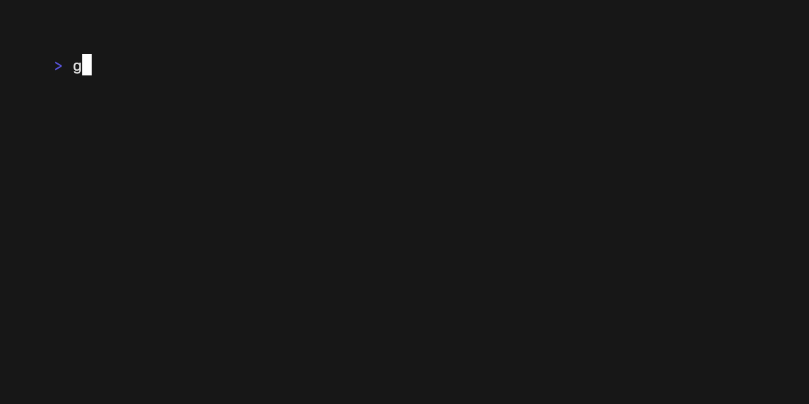

# Pipe

## Description

Reads piped input and renders it.

## Skill usage

Useful for skills involving reads piped input and renders it.

See `main.go` for the implementation details and terminal behavior.
