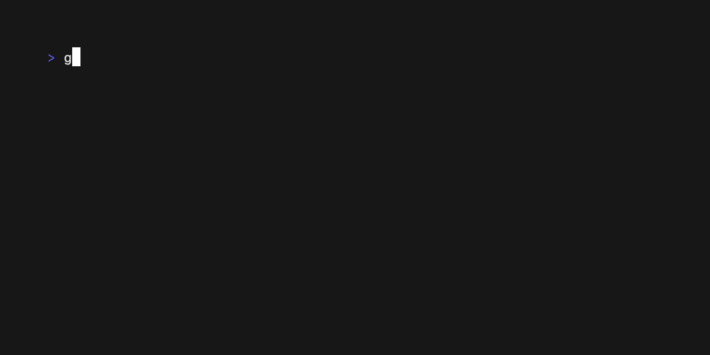

# Progress Animated

## Description

Continuously animated progress bar.

## Skill usage

Useful for skills involving continuously animated progress bar.

See `main.go` for the implementation details and terminal behavior.
