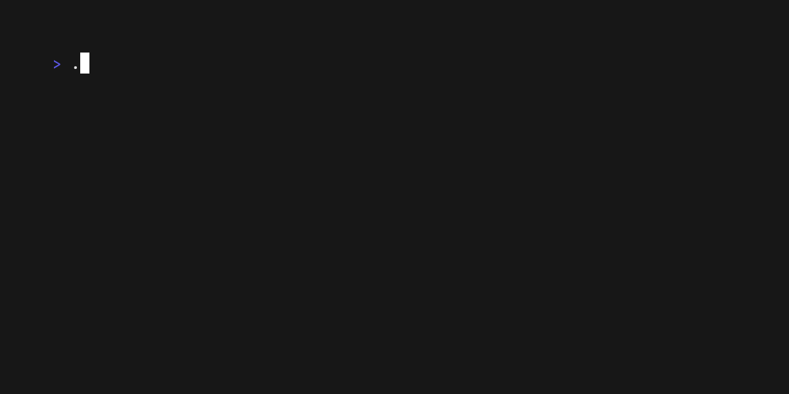

# Result

## Description

Shows a result screen after a flow.

## Skill usage

Useful for skills involving shows a result screen after a flow.

See `main.go` for the implementation details and terminal behavior.
