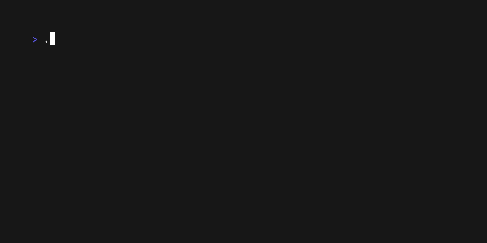

# Textarea

## Description

Multiline input with controls.

## Skill usage

Useful for skills involving multiline input with controls.

See `main.go` for the implementation details and terminal behavior.
