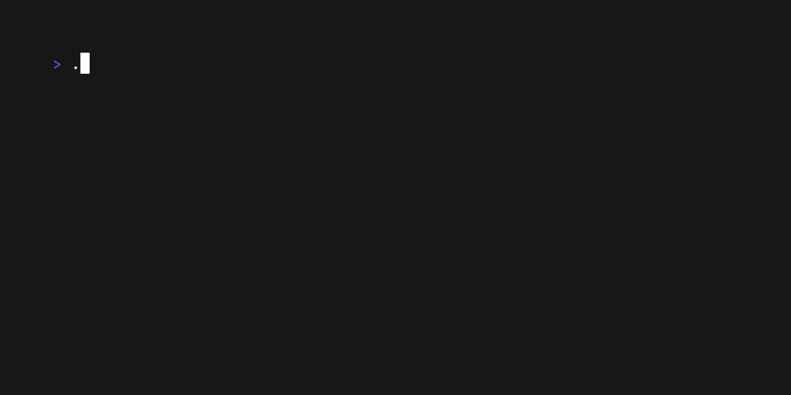

# Views

## Description

Switches between different screen views.

## Skill usage

Useful for skills involving switches between different screen views.

See `main.go` for the implementation details and terminal behavior.
